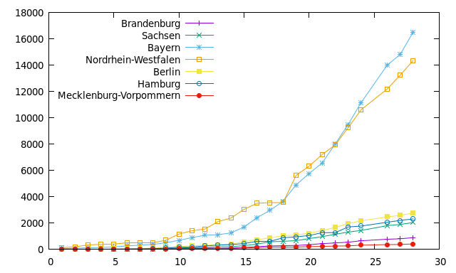

# Corona nach Bundesland

Leider gibt es gerade keine Corona-Verlaufszahlen nach Bundesland, deshalb ein paar Skripte:
* download.sh lädt die Rohdateien von rki.de herunter und transformiert die PDFs in Textdateien
* auslesen.sh > plotdata liest die Fallzahlen aus
* getcommand.sh generiert das Plot-Kommando für gnuplot (bspw. 'plotdata' u 1:2 w lines title 'Brandenburg', 'plotdata' u 1:3 w lines title 'Berlin', 'plotdata' u 1:4 w lines title 'Baden-Württemberg', 'plotdata' u 1:5 w lines title 'Bayern', 'plotdata' u 1:6 w lines title 'Bremen', 'plotdata' u 1:7 w lines title 'Hessen', 'plotdata' u 1:8 w lines title 'Hamburg', 'plotdata' u 1:9 w lines title 'Mecklenburg-Vorpommern', 'plotdata' u 1:10 w lines title 'Niedersachsen', 'plotdata' u 1:11 w lines title 'Nordrhein-Westfalen', 'plotdata' u 1:12 w lines title 'Rheinland-Pfalz', 'plotdata' u 1:13 w lines title 'Saarland', 'plotdata' u 1:14 w lines title 'Schleswig-Holstein', 'plotdata' u 1:15 w lines title 'Sachsen', 'plotdata' u 1:16 w lines title 'Thüringen')

Beispiel-Plot:

